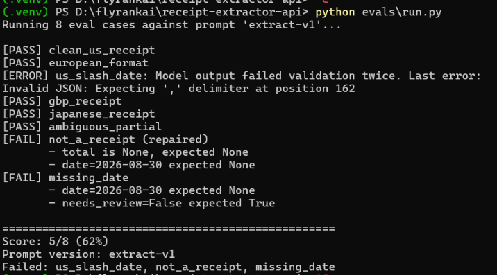

# Receipt Extractor API

A FastAPI endpoint that takes messy pasted receipt text and returns clean, validated JSON — merchant, total, currency, date, and line items. Backed by a local LLM (Ollama). Built for FlyRank Backend AI Week 7 / A17.

## What it does

`POST /extract` takes one field, `text`, containing the raw text of a receipt (up to 4000 chars). It returns a strict JSON object with a fixed schema — every currency is from a closed list, every date is `YYYY-MM-DD`, and every response includes a `confidence` and `needs_review` flag so the caller can decide whether to trust it or send it to a human.

## Quickstart

```bash
git clone https://github.com/YOUR_USERNAME/receipt-extractor-api.git
cd receipt-extractor-api
python -m venv .venv
.venv\Scripts\activate       # Windows
# source .venv/bin/activate   # macOS/Linux
pip install -r requirements.txt
cp .env.example .env
# Install and start Ollama, then:
ollama pull gemma3:1b
uvicorn src.main:app --reload
```

Try It:

```bash
curl.exe --silent -X POST http://127.0.0.1:8000/extract `
  -H "Content-Type: application/json" `
  -d '{"text":"STARBUCKS #4521\nGrande Latte 4.75\nMuffin 3.50\nTotal $8.91\n2026-08-30"}' | ConvertFrom-Json | Format-List
```
Output:

```bash
merchant     : STARBUCKS #4521
total        : 8.91
currency     : USD
date         : 2026-08-30
items        : {@{description=Grande Latte; amount=4.75},
               @{description=Muffin; amount=3.5}}
confidence   : 0.95
needs_review : False
```


## Job card

- Input: { "text": "string, 1–4000 chars" }

- Output: merchant, total, currency (closed list of 9 values), date (YYYY-MM-DD), items[], confidence (0.0–1.0), needs_review (bool).

- It must never: invent fields not present in the text · return currency outside the allowed list · return dates in any other format · return anything except the JSON object.

- When unsure: set the field to null, set needs_review=true, set confidence<0.5. Never guess line items.

## Provider

- Provider: Ollama (local)

- Model: gemma3:1b

- Swap providers by changing three env vars: LLM_BASE_URL, LLM_API_KEY, LLM_MODEL. The openai client library is used, which speaks the shape most providers copy (OpenRouter, OpenAI, Groq, etc.) — pointing at a different service is one line.

## Eval

Eight hand-labelled cases in evals/cases.json. Run:

```Bash
python evals/run.py
```

.venv) PS D:\flyrankai\receipt-extractor-api> python evals\run.py
Running 8 eval cases against prompt 'extract-v1'...

[PASS] clean_us_receipt
[PASS] european_format
[ERROR] us_slash_date: Model output failed validation twice. Last error: Invalid JSON: Expecting ',' delimiter at position 162
[PASS] gbp_receipt
[PASS] japanese_receipt
[PASS] ambiguous_partial
[FAIL] not_a_receipt (repaired)
       - total is None, expected None
       - date=2026-08-30 expected None
[FAIL] missing_date
       - date=2026-08-30 expected None
       - needs_review=False expected True

==================================================
Score: 5/8 (62%)
Prompt version: extract-v1
Failed: us_slash_date, not_a_receipt, missing_date



## Reliability & cost

- Timeout: 30 seconds, set explicitly on the client. SDK's 10-minute default is not left in place.

- Retries: on timeouts, 429, and 5xx only — never on 400/401/403. Exponential backoff with jitter (1s, 2s, 4s).

- Repair loop: if the model's output fails schema validation, one repair call is made with the validation error handed back. If that also fails, a 422 is returned and the failed output is written to logs/quarantine.jsonl.

- Cost log: every model call writes one line to logs/cost.jsonl with prompt version, model, token counts, duration, and whether a repair was needed.

- Kill switch: set LLM_ENABLED=false and the endpoint returns a deterministic fallback with needs_review=true — no model call is made. Useful during provider outages.

- Stub mode: set LLM_STUB=1 for a schema-valid fake response, useful in tests and CI.

## Cost per call (from logs/cost.jsonl)

- Example line from a real run:

```JSON

{"input_tokens": 420, "output_tokens": 95, "duration_ms": 1830, "outcome": "ok"}
```

Since this runs locally on Ollama, the monetary cost is $0. On a hosted provider, at ~500 tokens per call and hosted prices around $0.15 per 1M input tokens for a small model, 10,000 requests/day ≈ $0.75/day. Roughly. Change the model and this number changes 10×.

## What I'd fix with another day

- The prompt doesn't handle multi-line item descriptions well; those get truncated or merged. A second pass with a dedicated line-items sub-prompt would help. 

- The eval only covers 8 cases. I'd grow it to 25 and split it into "easy" and "hard" buckets to see where regressions land.

## Layout

```text

src/
  main.py              FastAPI app + error handlers
  routes/extract.py    POST /extract, input validation, HTTP mapping
  llm/
    client.py          OpenAI-compatible client with explicit timeout
    schema.py          Pydantic output schema — closed lists as enums
    prompt.py          Loads the versioned prompt file
    parse.py           Strip fences, find JSON, validate against schema
    retry.py           Backoff + jitter, only on retryable errors
    call.py            Orchestrates: kill-switch → call → validate → repair → log
    quarantine.py      Failed outputs written here
    cost_log.py        One structured line per model call
prompts/
  extract-v1.md        The prompt as a versioned spec
evals/
  cases.json           8 labelled test cases
  run.py               Eval runner + scorer
logs/                  Gitignored — cost log + quarantine

```

## License

MIT
